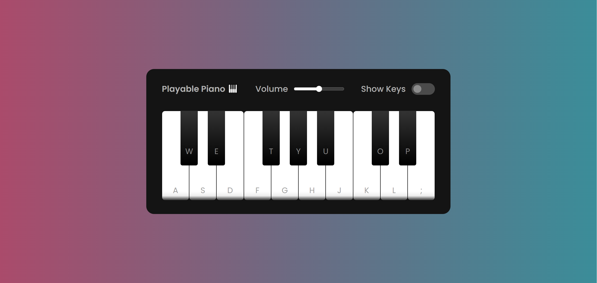

# Virtual Piano 🎹
Playing the [piano](https://shakiba-vakili.github.io/virtual-piano/) is an interesting skill, but coding the piano is much cooler. If you want to test it, you can play the piano through the keyboard and mouse and enjoy the sound.

